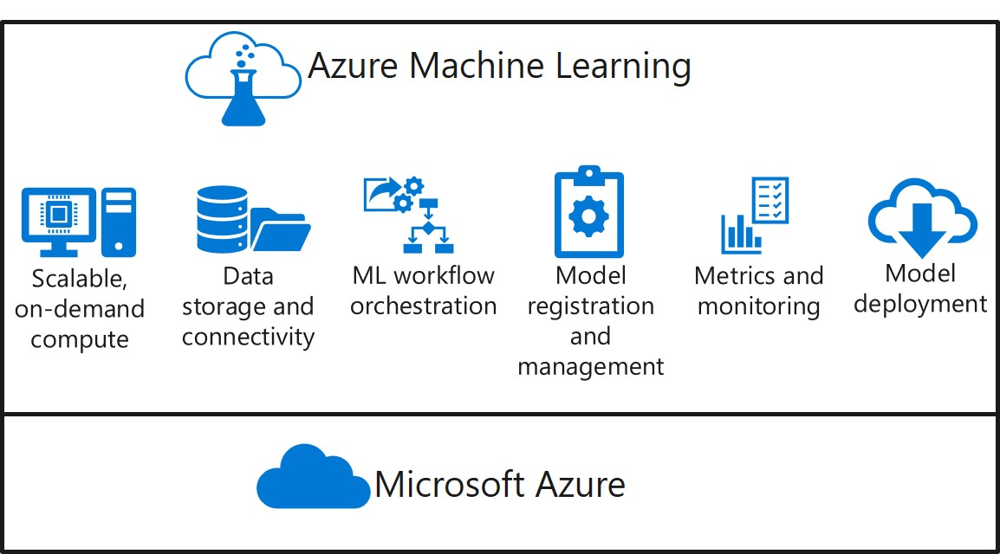
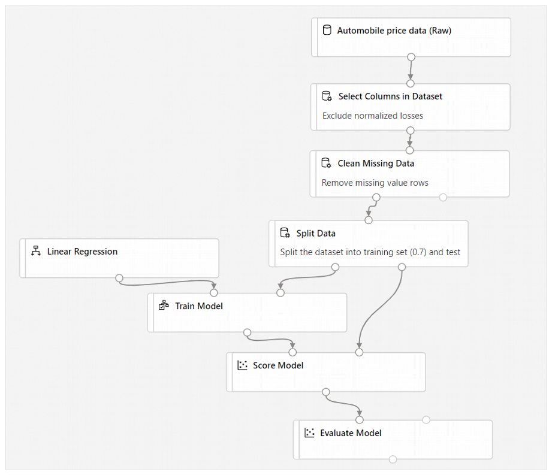
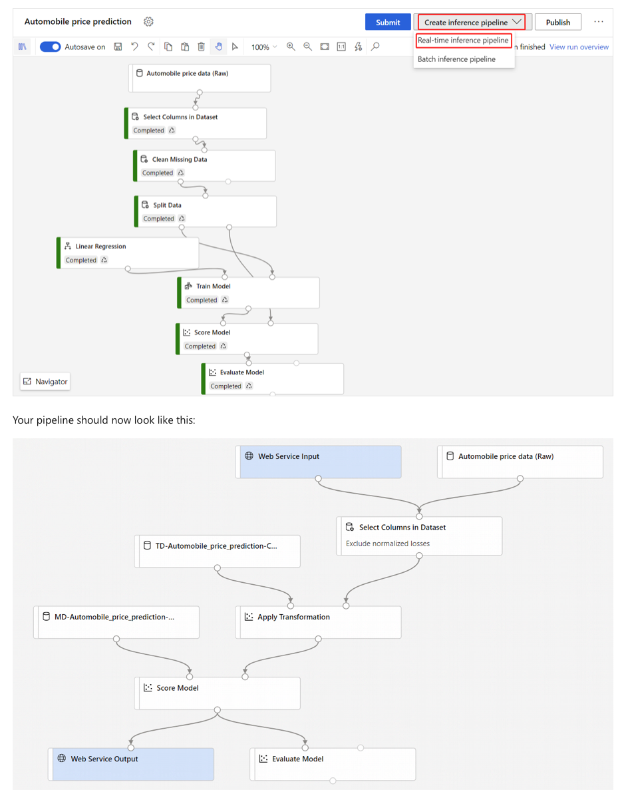

# Links

## Microsoft 

- https://github.com/MicrosoftDocs/ml-basics
- https://docs.microsoft.com/en-us/azure/machine-learning/tutorial-1st-experiment-sdk-setup-local

### SDK

  - AML SDK https://pypi.org/project/azureml-sdk/
  - AML SDK https://docs.microsoft.com/en-us/python/api/overview/azure/ml/?view=azure-ml-py

```
$ pip install azureml-sdk
```

## CLI

  - CLI SDK https://pypi.org/project/azure-cli/
  - CLI SDK https://github.com/Azure/azure-cli

```
$ az extension add -n azure-cli-ml
$ az ml --help
```

### Learning Path

- https://docs.microsoft.com/en-us/learn/paths/build-ai-solutions-with-azure-ml-service/ 
  - https://docs.microsoft.com/en-us/learn/modules/intro-to-azure-machine-learning-service/
  - https://docs.microsoft.com/en-us/learn/modules/train-local-model-with-azure-mls/
  - https://docs.microsoft.com/en-us/learn/modules/work-with-data-in-aml/
  - https://docs.microsoft.com/en-us/learn/modules/use-compute-contexts-in-aml/
  - https://docs.microsoft.com/en-us/learn/modules/create-pipelines-in-aml/
  - https://docs.microsoft.com/en-us/learn/modules/register-and-deploy-model-with-amls/
  - https://docs.microsoft.com/en-us/learn/modules/deploy-batch-inference-pipelines-with-azure-machine-learning/
  - https://docs.microsoft.com/en-us/learn/modules/tune-hyperparameters-with-azure-machine-learning/
  - https://docs.microsoft.com/en-us/learn/modules/automate-model-selection-with-azure-automl/
  - https://docs.microsoft.com/en-us/learn/modules/explore-differential-privacy/
  - https://docs.microsoft.com/en-us/learn/modules/explain-machine-learning-models-with-azure-machine-learning/
  - https://docs.microsoft.com/en-us/learn/modules/detect-mitigate-unfairness-models-with-azure-machine-learning/
  - https://docs.microsoft.com/en-us/learn/modules/monitor-models-with-azure-machine-learning/
  - https://docs.microsoft.com/en-us/learn/modules/monitor-data-drift-with-azure-machine-learning/

<p align="center"></p>


### Azure Machine Learning Exercises

- https://microsoftlearning.github.io/mslearn-dp100/
- https://github.com/MicrosoftLearning/mslearn-dp100 

### Algorithms

- https://docs.microsoft.com/en-us/azure/machine-learning/algorithm-cheat-sheet

### My Notes in cj-certifications repo

- https://github.com/cjoakim/cj-certifications/blob/master/dp-100/terms.md

---

## Tutorial; Get started with Azure Machine Learning 

- Part 1/4: https://docs.microsoft.com/en-us/azure/machine-learning/tutorial-1st-experiment-sdk-setup-local
- Part 2/4: https://docs.microsoft.com/en-us/azure/machine-learning/tutorial-1st-experiment-hello-world
- Part 3/4: https://docs.microsoft.com/en-us/azure/machine-learning/tutorial-1st-experiment-sdk-train
- Part 4/4: https://docs.microsoft.com/en-us/azure/machine-learning/tutorial-1st-experiment-bring-data

---

## Designer

<p align="center"></p>

---

<p align="center"></p>

---

## Other

- PyPI: https://pypi.org/
- https://github.com/PacktPublishing/Mastering-Azure-Machine-Learning
- https://github.com/ageron/handson-ml2  (O'Reilly HOML book, 2nd Edition)
- Conda: https://docs.conda.io/projects/conda/en/latest/user-guide/install/macos.html
- https://www.kaggle.com/sixteenpython/machine-learning-with-iris-dataset/data?select=Iris.csv 
- https://www.datacamp.com/community/blog/keras-cheat-sheet
- VS Code Preview: https://docs.microsoft.com/en-us/azure/machine-learning/how-to-manage-resources-vscode